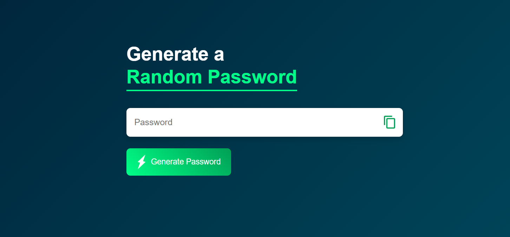
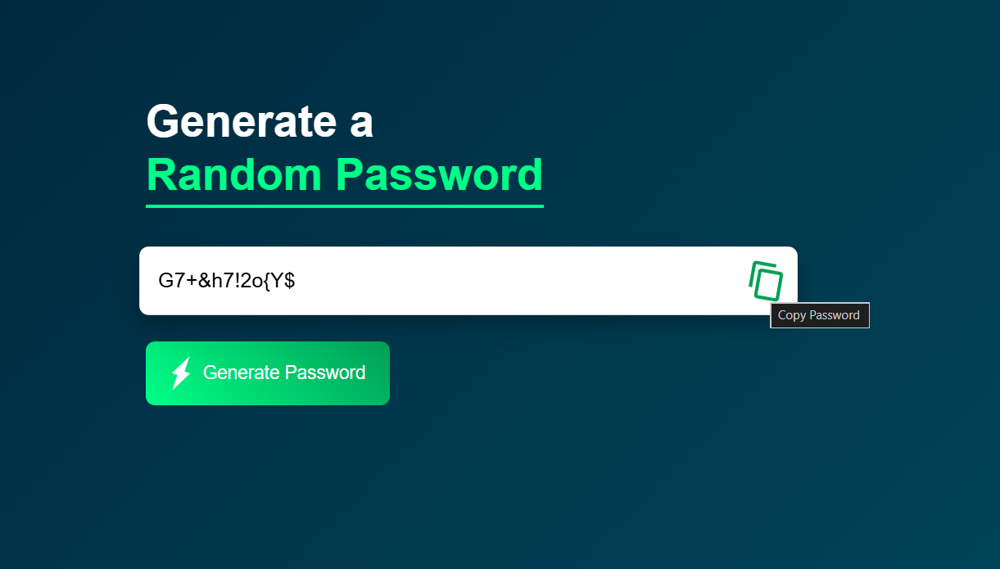

# 🔐 Password Generator

<div align="center">

# Generate Strong & Secure Passwords Instantly


A modern Password Generator built using HTML, CSS, and JavaScript that creates strong, secure, and randomized passwords with a single click.

</div>

---

## 📸 Screenshots

<div align="center">

### Home Screen



<br><br>

### Generated Password



</div>

---

## 🚀 Features

* 🔐 Generates secure random passwords
* 🔠 Includes uppercase letters (A-Z)
* 🔡 Includes lowercase letters (a-z)
* 🔢 Includes numbers (0-9)
* 🔣 Includes special symbols
* 🎲 Password shuffling for better randomness
* 📋 One-click copy to clipboard
* ⚡ Instant password generation
* 🎨 Modern animated interface
* 📱 Responsive design

---

## 🎯 Project Overview

This application helps users generate strong passwords for websites, applications, and online accounts.

To improve security, each generated password contains:

* At least one uppercase letter
* At least one lowercase letter
* At least one number
* At least one special symbol

The password is then shuffled to eliminate predictable character placement and improve randomness.

---

## 🛠️ Tech Stack

| Technology       | Purpose                   |
| ---------------- | ------------------------- |
| HTML5            | Structure                 |
| CSS3             | Styling & Animations      |
| JavaScript (ES6) | Password Generation Logic |

---

## 🔒 Password Generation Logic

The generator guarantees character diversity by including characters from every category before filling the remaining positions randomly.

```javascript id="52vg5s"
password += getRandomChar(upperCase);
password += getRandomChar(lowerCase);
password += getRandomChar(number);
password += getRandomChar(symbols);
```

This ensures stronger and more secure passwords.

---

## 🎲 Password Randomization

After generation, the password is shuffled to increase unpredictability.

```javascript id="40nl6s"
function shufflePassword(password) {
    return password
        .split('')
        .sort(() => Math.random() - 0.5)
        .join('');
}
```

This prevents fixed character placement patterns.

---

## 📋 Copy to Clipboard

The application supports modern Clipboard APIs.

```javascript id="m4u83w"
navigator.clipboard.writeText(passwordBox.value);
```

A fallback method is also implemented for broader browser compatibility.

---

## 🎨 User Interface Highlights

### Modern Design

* Elegant dark gradient background
* Clean password display panel
* Bright accent colors
* Modern typography

### Interactive Experience

* Hover animations
* Button click effects
* Animated copy icon
* Smooth transitions

### User-Friendly Workflow

1. Click **Generate Password**
2. Instantly receive a secure password
3. Click the copy icon
4. Paste anywhere

---

## 📂 Project Structure

```text id="ff7x4u"
04-PASSWORD GENERATOR/
│
├── screenshots/
│   ├── password-generator-home.png
│   └── password-generated.png
│
├── images/
│   ├── copy.png
│   └── generate.png
│
├── index.html
├── style.css
├── app.js
└── README.md
```

---

## 🚀 Getting Started

### Clone the Repository

```bash id="fjy9h6"
git clone https://github.com/amittdas/password-generator.git
```

### Navigate to the Project Folder

```bash id="icv2j7"
cd "04-PASSWORD GENERATOR"
```

### Run the Project

Open:

```text id="t71f9z"
index.html
```

in your browser.

---

## 📚 Concepts Practiced

* DOM Manipulation
* Event Handling
* Random Number Generation
* Clipboard API
* String Manipulation
* Array Methods
* CSS Animations
* Responsive Design

---

## 🔮 Future Enhancements

* 🎚️ Adjustable Password Length
* ☑️ Custom Character Selection
* 👁️ Show / Hide Password
* 📊 Password Strength Meter
* 📝 Password History
* 🌙 Dark / Light Theme Toggle
* 🔒 Multiple Security Levels

---

## 👨‍💻 Author

### Amit Das

Final Year B.Tech (Information Technology)

**Skills**

* HTML
* CSS
* JavaScript
* TypeScript
* MERN Stack
* C++
* Python

GitHub: https://github.com/amittdas

---

<div align="center">

### ⭐ If you found this project useful, consider giving it a star!

Built with ❤️ using HTML, CSS and JavaScript.

</div>
